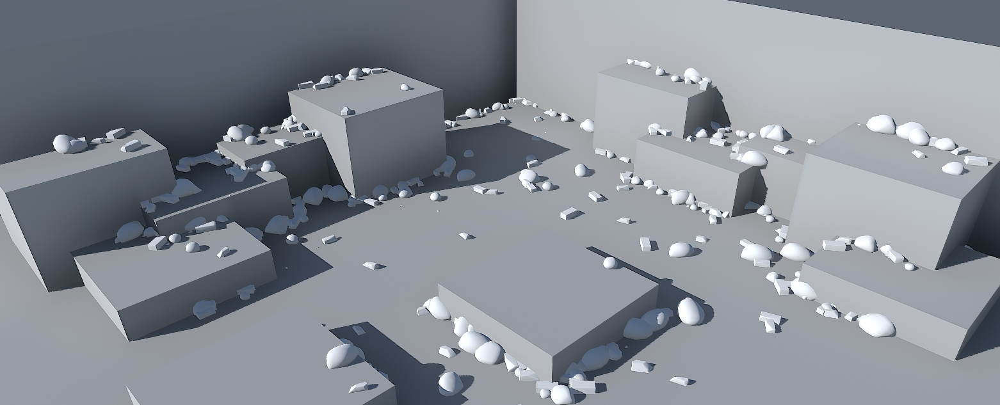
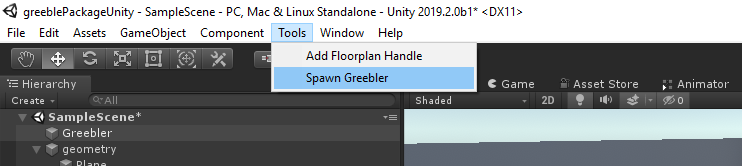
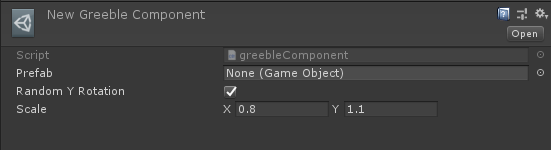
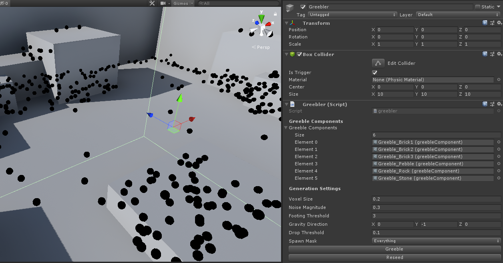
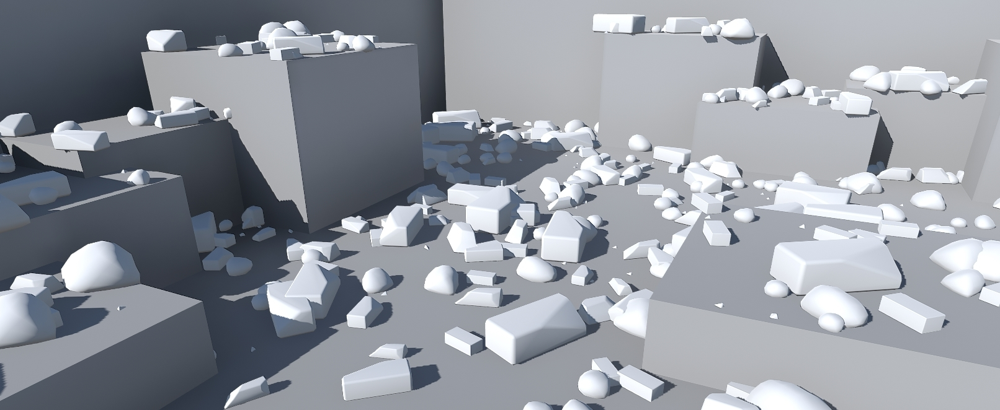
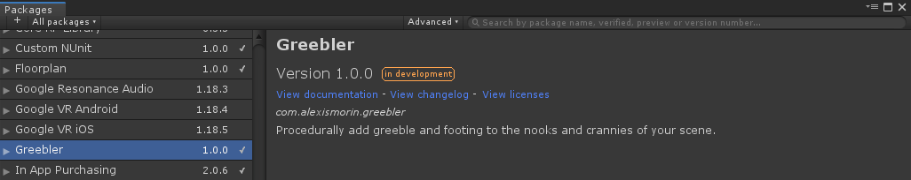
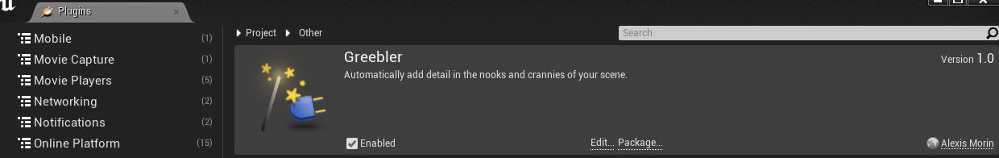

# Greebler
## UE4 & Unity plugin to automatically add detail in the nooks and crannies of your scene

In her [2017 GDC presentation](https://www.youtube.com/watch?v=WumyfLEa6bU), Tracery developer Kate Compton talks of *greebling* and *footing* as two vital elements of believable environments. Greebling and footing is fine detailing added to the surface and cracks of a larger object that makes it appear more complex, and therefore more visually interesting. In games, this is often a vital part of the level art pass and most game developers have various takes on the practice (my personal favourite is Hidetaka Miyazaki's addiction to [planting headstones all over the place](http://cdn.cheatcc.com/guide_screens/dark_souls_3/ds3_cemetery_bonfire.jpg).

While nowadays realtime mesh painting tools allow for impressive customization and complex detailing, the final greebling pass is often done manually and (to the pained cries of level artists) often requires touch-ups when (not if, *when*) the level design changes. With this engine-agnostic plugin, you can now simply set a bounding volume, throw in the meshes you'd like to use and you will then be able to interactively instance them all over the map (while also being able to control values like noise magnitude, mesh orientation and density).

**While the the Unity package is fully functional, I'm still at work on the Unreal version (Yes I'm actually on it, I need for a production). Hang tight!**

### Usage - Unity

The package installed, simply navigate to the new *Tools/Spawn Greebler* menu item to spawn the greebler manager object in the scene. If you have gizmos enable you should now see a bunch of black dots in the bounding volume - these are the preview locations for your greeble.

You now have a new asset type, the *Greeble Component*. It's pretty self explanatory (message me if you still have issues) - this is essentially the asset type you use to populate your scene with the greeble manager.

You can tweak a few settings (if you're feeling anxious they all have in-engine tooltips):

- Voxel Size: How dense should the generated previews and greeble be. Smaller numbers = higher detail
- Noise Magnitude: Noise applied to the final spawn positions.
- Footing Threshold: Higher values here will make greeble only appear in cracks. 3 is a good value, use 2 for stuff like grass.
- Gravity Direction: Vector direction of where greeble will settle. Set to 0,1,0 for stalactites?
- Drop Threshold: Voxel threshold to spawn greeble. Higher values = Higher density though you probably should just decrease voxel size.
- Spawn Mask: Spawn mask to decide on which layers to spawn greeble.

When you're happy with the preview, press the *Greeble* button and your scene should get populated with meshes. If you're unhappy with it, press *Reseed* and keep tweaking!

Per usual for small meshes, remember to have them non-static and with a GPU instanced shader to save on performance.

### Install process
The repository is split for the two engines: the *Plugin* folder's for Unreal and the *Packages* folder for Unity.

#### Unity 2019.2

This is a plugin that makes use of Unity's *Package Manager* feature. Just drop the *com.alexismorin.greebler* folder into your *packages* folder (found at the same level as the Assets folder) and it should work out-of-the-box. If you're using a pre-packman version of Unity (maybe supported, can be made to work if you're courageous), take the stuff inside the *com.alexismorin.greebler* folder and then drag it anywhere into your regular project hierarchy.

#### Unreal 4.22

Just drag the *Greebler* folder into your project's *Plugins* folder (create it at the same level as your content folder if you don't have one already) and open your project - things should work out by themselves.

Per usual, this was whipped up in a couple of hours on my couch (and a few on my bed here and there, give me a break) - bugs beware, tweak or fork as you wish 👨🏻‍🎨